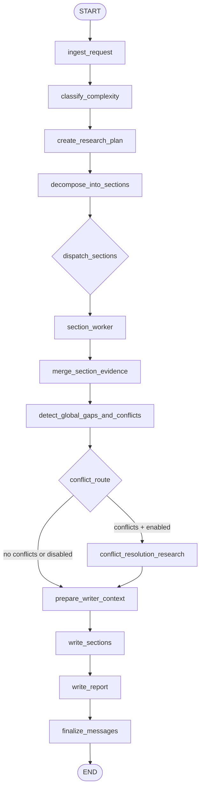
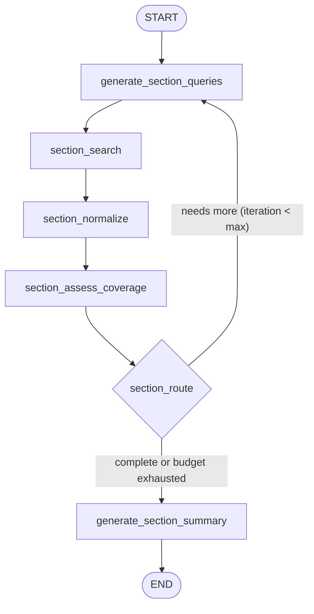

# Deep Research Agent

A graph-based deep research workflow built with LangGraph. The current default architecture is a section-oriented research system: it reads a query, plans the report, splits the topic into sections, runs parallel section workers, merges evidence, optionally resolves conflicts, and writes a grounded markdown report with citations.

The older single-agent iterative loop still exists in the codebase as a legacy path, but `run.py` uses the newer Phase 2 flow by default.

## What It Does

- accepts a research question from the CLI
- classifies query complexity and creates a research plan
- optionally pauses for plan approval before expensive research starts
- runs web search across one of several providers
- normalizes and deduplicates evidence
- prepares a capped writer context instead of dumping all results into the writer
- writes a report to `reports/`
- can also save process logs, research traces, and post-run eval scores

## Prerequisites

- Python 3.11+
- `OPENAI_API_KEY`
- At least one search provider key:
  - `EXA_API_KEY`
  - `TAVILY_API_KEY`
  - `GENSEE_API_KEY`

Supported search providers in code are `exa`, `tavily`, `gensee`, and `gensee_deep`.

## Setup

1. Create and activate a virtual environment:

```bash
python -m venv .venv
source .venv/bin/activate
```

2. Install dependencies:

```bash
pip install -r requirements.txt
```

3. Create a `.env` file:

```bash
cp .env.example .env
```

4. Add your keys:

```bash
OPENAI_API_KEY=your-openai-api-key
EXA_API_KEY=your-exa-api-key
TAVILY_API_KEY=your-tavily-api-key
GENSEE_API_KEY=your-gensee-api-key
```

You do not need all search keys, but you do need at least one of them.

## Basic Usage

Run a query:

```bash
python run.py "What are the main differences between LangGraph and CrewAI?"
```

Read from stdin:

```bash
echo "Compare Python and Rust for backend systems" | python run.py
```

Write output somewhere else:

```bash
python run.py "Your query" -o ./output
```

Change the search provider or iteration budget:

```bash
python run.py "Your query" --search-provider exa
python run.py "Your query" --max-iterations 2
```

Skip plan approval for non-interactive runs:

```bash
python run.py "Your query" --auto
```

## Useful CLI Flags

- `--config PATH` load a custom config file
- `--search-provider {exa,tavily,gensee,gensee_deep}` choose the web search backend
- `--max-iterations N` override both the top-level and section iteration budget
- `--search-depth {basic,advanced}` set search depth where supported
- `--extract-depth {basic,advanced}` control page enrichment depth
- `--auto` skip interactive plan approval
- `--eval` run the evaluation suite after report generation
- `--trace` save a research trace JSON file next to the report
- `--log` save process logs automatically alongside the report
- `--log path/to/file.log` write logs to a specific file
- `-o, --output PATH` choose the output directory

## Visualize in LangSmith Studio

You can run the research graph locally and visualize it in [LangSmith Studio](https://docs.langchain.com/langsmith/quick-start-studio) (for [deployed graphs](https://docs.langchain.com/langsmith/quick-start-studio#deployed-graphs) or the local dev server).

### Local development server

1. Install the LangGraph CLI (included in `requirements.txt`):

   ```bash
   pip install -r requirements.txt
   # or for local dev only: pip install -U "langgraph-cli[inmem]"
   ```

2. From the project root, start the Agent Server:

   ```bash
   langgraph dev
   ```

   The server runs at `http://localhost:2024` (or the port shown). No Docker is required when using `langgraph-cli[inmem]`.

3. Open Studio:

   - Go to [LangSmith Studio](https://smith.langchain.com/studio/?baseUrl=http://127.0.0.1:2024), or
   - In [LangSmith](https://smith.langchain.com) → **Deployments** → **Connect to a local server** and enter `http://127.0.0.1:2024`.

4. Select the **research** graph to inspect the flow, run threads, and debug.

To avoid sending trace data to LangSmith while testing locally, set `LANGSMITH_TRACING=false` in your `.env`.

**Tracing large runs:** Deep research runs can produce traces over LangSmith’s ~20MB ingest limit. Use **`--langsmith-light`** to trace while staying under the limit: inputs/outputs are hidden, but you still get the run tree, node names, timing, and errors. For full local fidelity use `--trace` (saves `*_trace.json`) and `--log` (saves prompts/decisions).

### Deployed graphs

If you [deploy](https://docs.langchain.com/langsmith/deployment-quickstart) this app (e.g. via LangGraph Cloud), open the deployment in the LangSmith UI and select **Studio** to connect to the live deployment and manage threads, assistants, and memory there.

## Outputs

Each run writes a unique markdown report into `reports/` by default:

- `report_<query>_<timestamp>.md`

Optional extras:

- `log_<query>_<timestamp>.log` when `--log` is enabled
- `report_<query>_<timestamp>_trace.json` when `--trace` is enabled

If `--eval` is enabled, eval scores are printed after the run.

## Default Graph Flow

This is the current default runtime path:



In plain language:

1. `ingest_request` reads the query and initializes state.
2. `classify_complexity` selects the planning tier.
3. `create_research_plan` proposes the report structure.
4. The CLI can pause here so the user can approve, edit, or cancel the plan.
5. `decompose_into_sections` creates section tasks.
6. Each `section_worker` loops through query generation, search, normalization, and section-level coverage checks.
7. `merge_section_evidence` combines section results.
8. `detect_global_gaps_and_conflicts` decides whether more conflict-focused research is needed.
9. `prepare_writer_context` ranks and caps evidence for the writer.
10. `write_sections` drafts section content.
11. `write_report` assembles the final report.
12. `finalize_messages` appends the report to graph messages.

### Section Worker Subgraph

Each section worker runs this loop independently (in parallel):



## Legacy Phase 1 Flow

The older single-agent loop still exists in `deep_research/graph.py` as `create_research_graph_phase1()`. That path is:

ingest -> classify -> plan queries -> search -> normalize -> assess coverage -> loop or write

It is useful as a simpler baseline, but it is not the default CLI flow anymore.

## Configuration

The main tuning surface is `config.yaml`. It lets you control:

- search provider and search depth
- max iterations and queries per iteration
- writer context size
- full-page enrichment
- section-worker settings
- conflict-resolution behavior
- model choices
- prompt overrides
- final report structure

Example config areas:

- `search`
- `extract`
- `models`
- `writer`
- `section`
- `conflict`
- `report`
- `prompts`

CLI arguments override values loaded from `config.yaml`.

### Programmatic usage

```python
from deep_research.graph import create_research_graph
from langchain_core.messages import HumanMessage

graph = create_research_graph()
config = {
    "configurable": {
        "search_provider": "exa",
        "max_iterations": 3,
        "queries_per_iteration": 5,
        "results_per_query": 5,
        "writer_context_max_items": 30,
        "fetch_full_pages": True,
    }
}

result = graph.invoke(
    {"messages": [HumanMessage(content="Your query")]},
    config=config,
)
```

## Evaluation

With `--eval`, the repo runs a post-generation eval suite from `deep_research/evals/`.

The current checks include:

- claim support
- factual accuracy
- citation relevance
- source quality
- section completeness
- comparative breadth
- synthesis quality
- conflict handling
- stop decision quality
- tool trajectory quality

These evals are mainly for inspection and benchmarking, not hard guarantees of correctness.

## Tests

Run tests with:

```bash
pytest tests/ -v
```

Most unit-style tests run without API keys. Some end-to-end paths require `OPENAI_API_KEY` plus at least one configured search provider key.
