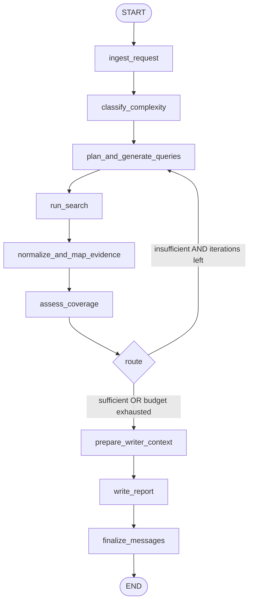

# Deep Research Agent

A single-agent iterative deep research workflow built with LangGraph. The agent accepts a user query, classifies its complexity, plans the report, runs web searches, normalizes evidence, assesses coverage in a loop, and produces a grounded markdown report with citations.

## Prerequisites

- Python 3.11+
- API keys: [OpenAI](https://platform.openai.com/), and either [Gensee](https://docs.gensee.ai/) or [Tavily](https://app.tavily.com/sign-in) for web search

## Setup

1. Clone the repository and create a virtual environment:

```bash
python -m venv .venv
source .venv/bin/activate   # On Windows: .venv\Scripts\activate
```

2. Install dependencies:

```bash
pip install -r requirements.txt
```

3. Create a `.env` file (copy from `.env.example`):

```bash
cp .env.example .env
```

4. Add your API keys to `.env`:

```
OPENAI_API_KEY=your-openai-api-key
GENSEE_API_KEY=your-gensee-api-key   # or TAVILY_API_KEY for Tavily
```

## Run

```bash
python run.py "What are the main differences between GPT-4 and Claude?"
```

Each run creates a unique report file in `reports/` (e.g. `reports/report_Your_query_2025-03-08_14-30-22.md`). Use `-o` to change the output directory:

```bash
python run.py "Your query" -o ./output
```

With configurable max iterations or search provider:

```bash
python run.py "Compare Python vs Rust" --max-iterations 2
python run.py "Your query" --search-provider tavily
```

## Configuration

Pass options via `config` when invoking the graph programmatically:

```python
from deep_research.graph import create_research_graph
from langchain_core.messages import HumanMessage

graph = create_research_graph()
config = {
    "configurable": {
        "max_iterations": 3,
        "queries_per_iteration": 5,
        "results_per_query": 5,
        "writer_context_max_items": 30,
    }
}
result = graph.invoke(
    {"messages": [HumanMessage(content="Your query")]},
    config=config,
)
```

| Option | Default | Description |
|--------|---------|-------------|
| `max_iterations` | 3 | Max research loop iterations |
| `queries_per_iteration` | 5 | Max search queries per iteration |
| `results_per_query` | 5 | Max results per search query |
| `writer_context_max_items` | 30 | Max evidence items passed to the writer |
| `search_provider` | "gensee" | "gensee" or "tavily" (falls back to whichever API key is set) |
| `fetch_full_pages` | True | Fetch full page content (not just snippets) for richer reports |

## Graph Flow



1. **ingest_request** – Read query from messages, initialize state
2. **classify_complexity** – Classify as simple/moderate/complex, select planner model
3. **plan_and_generate_queries** – Define report outline and search queries
4. **run_search** – Execute searches via Gensee or Tavily (no LLM)
5. **normalize_and_map_evidence** – Convert results to structured evidence
6. **assess_coverage** – Decide if coverage is sufficient
7. **route** – Loop back to planning or proceed to writing
8. **prepare_writer_context** – Curate evidence subset for the writer
9. **write_report** – Generate grounded markdown report
10. **finalize_messages** – Append report to messages

## Tests

```bash
pytest tests/ -v
```

Unit tests run without API keys. E2E tests require `OPENAI_API_KEY` and either `GENSEE_API_KEY` or `TAVILY_API_KEY`.
